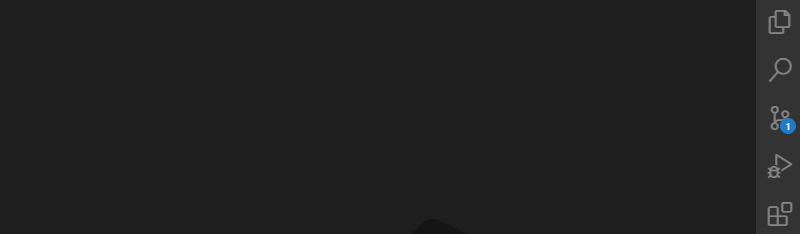
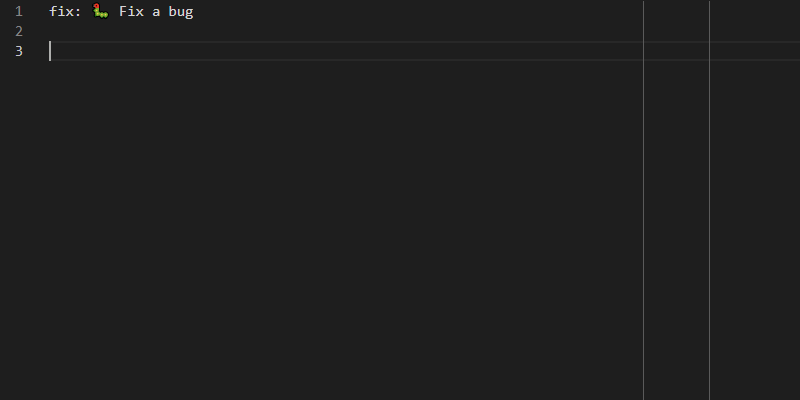
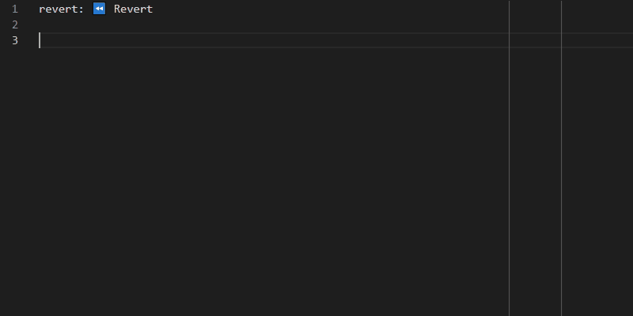
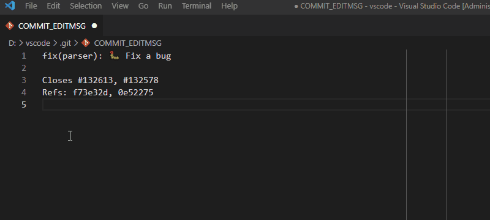

# Git Commit Message Editor

Edit commit messages via VS Code's editor and Autocomplete for Conventional Commits.


## Features

- Supports to edit commit messages via VS Code's editor
    - See [details](#editor) below
- Supports IntelliSense to edit commit messages that conform to [Conventional Commits Specification](https://conventionalcommits.org/)
    - Auto Completions
        - [Commit Types completion](#commit-types-completion)
        - [Scopes completion](#scopes-completion)
            - Includes Workspace level user scopes management
            - Supports auto grepping the scopes from existing commit history
        - [Gitmojis completion](#gitmojis-completion)
        - [Footer Types completion](#footer-types-completion)
        - [Issues completion](#issues-completion) for the Footer Type `Closes`
        - [Commits completion](#commits-completion) for the Footer Type `Refs`
    - [Hovers](#hovers)
        - Over `Type`, `Scope`, and `Emojis` of the Summary line
        - Over `Type`, `Issues`, and `Commits` of the Footer lines
    - See [details](#intellisense) below
- Selecting the previous commit message by `Recent commits...` CodeLens link
    - See [details](#codelens) below

## Installation

To install this extension go to **View > Extensions** and search for `git-commit-message-editor`. Next click Install and then Reload.

## Usage

### Editor

You can open the commit message editor by clicking the **Edit icon** in the repository in the **Source Control** view.


Or select **Open Commit Message Editor** from the overflow menu in the repository in the **Source Control** view.
> Or launch **Git: Open Commit Message Editor** command on the **Command Palette**.


Type commit messages with **IntelliSense** feature and then save it. The **Source Control** Input Box be filled with the message you typed.



If you don't want to close the commit message editor window after saving, change `gitCommitMessageEditor.editor.keepAfterSave` option to `true`. Note that auto-focusing to the **Source Control** view only works with the option is `false`.

> **Note:** The commit message editor **does not actually create** a `workspace/.git/COMMIT_EDITMSG` file. The file IO operations are handled by the VFS (Virtual File System).

### IntelliSense

You can trigger **IntelliSense** in the commit message editor window by typing <kbd>Ctrl</kbd>+<kbd>Space</kbd>, or by typing the letters.
> Also supported in the [VS Code as Git editor](https://code.visualstudio.com/docs/editor/versioncontrol#_vs-code-as-git-editor) mode.


All completions conform to [**Conventional Commits Specification**](https://conventionalcommits.org/).

#### Commit Types completion

List of available conventional commit types:
> Commit types originally from [commitizen/cz-conventional-changelog](https://github.com/commitizen/cz-conventional-changelog)

| Type     | Title                    | Description                                                                                                 |
| -------- | ------------------------ | ----------------------------------------------------------------------------------------------------------- |
| feat     | Features                 | A new feature                                                                                               |
| fix      | Bug Fixes                | A bug fix                                                                                                   |
| docs     | Documentation            | Documentation only changes                                                                                  |
| style    | Styles                   | Changes that do not affect the meaning of the code (white-space, formatting, missing semi-colons, etc)      |
| refactor | Code Refactoring         | A code change that neither fixes a bug nor adds a feature                                                   |
| perf     | Performance Improvements | A code change that improves performance                                                                     |
| test     | Tests                    | Adding missing tests or correcting existing tests                                                           |
| build    | Builds                   | Changes that affect the build system or external dependencies (example scopes: gulp, broccoli, npm)         |
| ci       | Continuous Integrations  | Changes to our CI configuration files and scripts (example scopes: Travis, Circle, BrowserStack, SauceLabs) |
| chore    | Chores                   | Other changes that don't modify src or test files                                                           |
| revert   | Reverts                  | Reverts a previous commit                                                                                   |
| wip      | Work In Progress         | A commit that will be squashed later                                                                        |
| initial  | Initial                  | Initial commit                                                                                              |

#### Scopes completion

You can type a scope manually, select one that is saved, or create a new scope by selecting the `Create New Scope` item in the suggestion list.
> **Note:** If `gitCommitMessageEditor.intelliSense.completion.logScopes.enabled` option is `true`, the scope suggestion list also includes the parsed scopes from existing commit history.


The scope allows only words, underscores, hyphens, and dots (can optionally begin with $) and will be saved into `workspace/.vscode/settings.json`.

#### Gitmojis completion

> Check out available emojis on [Gitmoji](https://gitmoji.dev/)

You can trigger the gitmoji suggestions by typing a trigger character `:` (colon).


The gitmojis completion only works in the subject section of the summary and offers the gitmoji suggestions by `Commit Type` that you typed. If you want to show all gitmoji suggestions, cancel (pressing <kbd>Esc</kbd>) the suggestions widget and re-trigger by typing <kbd>Ctrl</kbd>+<kbd>Space</kbd> follow the `:` (colon).

#### Footer Types completion

Also supports the footer type completion.


List of available conventional footer types:

| Type            | Title               | Description                                                                    |
| --------------- | ------------------- | ------------------------------------------------------------------------------ |
| Closes          | Referencing issues  | A code change that related issues to close (for example, Closes #​133)         |
| Refs            | Referencing commits | A code change that related other commits (for example, Refs: 676104e, a215868) |
| BREAKING CHANGE | Breaking changes    | A code change that causes other features to fail                               |

#### Issues completion

You can trigger the issue suggestions by selecting the `Closes` item in the footer type suggestion list, or by typing a trigger character `#` (number sign) on the `Closes` footer line.



The issue suggestions are provided from your remote git hosting service. The issue items suggested are cached, and the caches will be cleared when the editor closed.

Currently, you can use the git hosting service GitHub only. Note that GitHub API allows for up to 60 requests (for fetching issues) per hour. If you'd like to get a higher GitHub API rate limit, you can authenticate with the GitHub authentication (built-in) extension. See [GitHub API Rate limiting](https://docs.github.com/en/rest/overview/resources-in-the-rest-api#rate-limiting) for more information.

#### Commits completion

You can trigger the commit suggestions by selecting the `Refs` item in the footer type suggestion list, or by typing <kbd>Ctrl</kbd>+<kbd>Space</kbd> on the `Refs` footer line.



The commit suggestions are provided from your local repository.

#### Hovers

You can hover over that `Type`, `Scope`, and `Emojis` of the Summary line and `Type`, `Issues`, and `Commits` of the Footer lines.



### CodeLens

To select the previous commit message, click the `Recent commits...` CodeLens link.
> Or use the keyboard shortcut <kbd>Ctrl</kbd>+<kbd>Shift</kbd>+<kbd>'</kbd>.


The CodeLens link will appear only when no commit message is typed.

## Settings

Table of contributed settings (prefix "gitCommitMessageEditor."):

| Name                                      | Default | Description                                                                                          |
| ----------------------------------------- | ------- | ---------------------------------------------------------------------------------------------------- |
| editor.keepAfterSave                      | `false` | Controls whether the commit message editor tab keep or close, after saving                           |
| codeLens.recentCommits.enabled            | `true`  | Controls whether the `Recent commits...` code lens feature is enabled or not                         |
| codeLens.recentCommits.maxItems           | `32`    | Specifies the maximum number of commits to show in the quick pick UI                                 |
| intelliSense.completion.enabled           | `true`  | Controls whether the \"Quick suggestions\" feature is enabled or not                                 |
| intelliSense.completion.scopes            | `[]`    | Scopes that user created (Scopes will be saved into `workspace/.vscode/settings.json`)               |
| intelliSense.completion.logScopes.enabled | `false` | Controls whether the scope suggestions include or not the parsed scopes from existing commit history |
| intelliSense.completion.issues.pageSize   | `20`    | Specifies the maximum number of issues per page to show in the suggestions widget                    |
| intelliSense.hover.enabled                | `true`  | Controls whether the \"Hover\" feature is enabled or not                                             |

And recommends adding a setting below into your Global or Workspace `settings.json`, if you want to follow the **Git 50/72 rule**.

```json
"[git-commit]": {
    "editor.rulers": [
        50,
        72
    ]
}
```

## Issues

If you find any problems using this extension, or you want to propose new features to it, feel free to open an issue on [GitHub](https://github.com/phoihos/vscode-git-commit-message-editor/issues).

## Release Notes

Detailed Release Notes are available [here](https://github.com/phoihos/vscode-git-commit-message-editor/blob/master/CHANGELOG.md) or above **Changelog** tab.

## Attributions

Icon made by [Freepik](https://www.flaticon.com/authors/freepik) from [www.flaticon.com](https://www.flaticon.com/)
