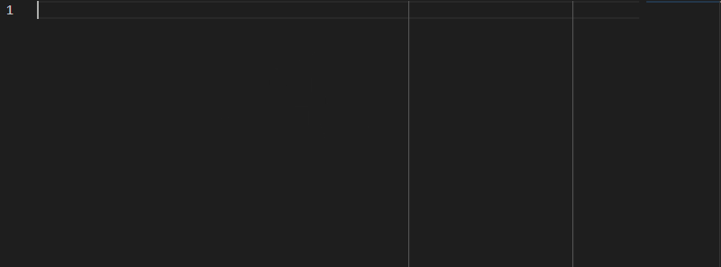
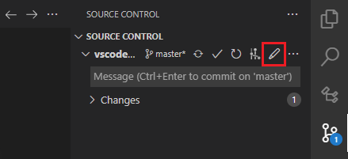
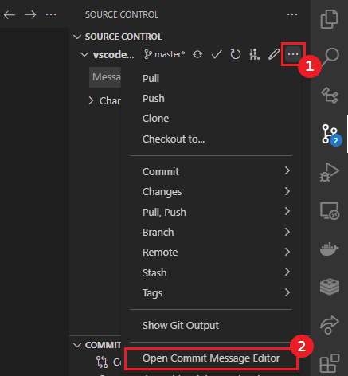
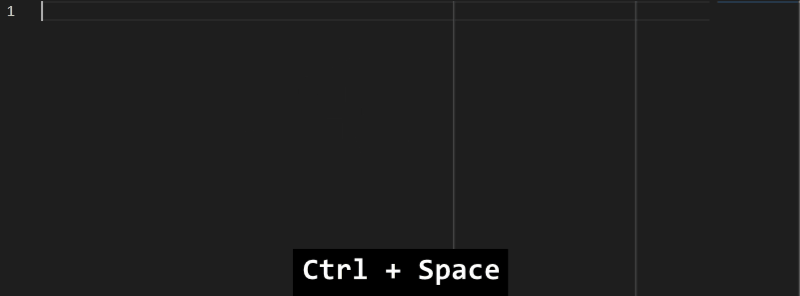
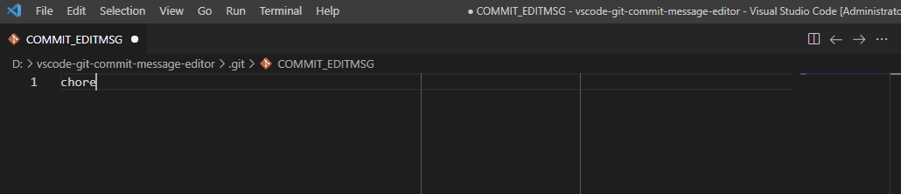
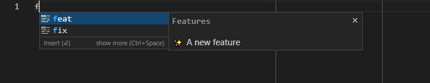
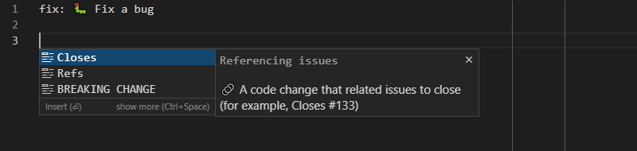
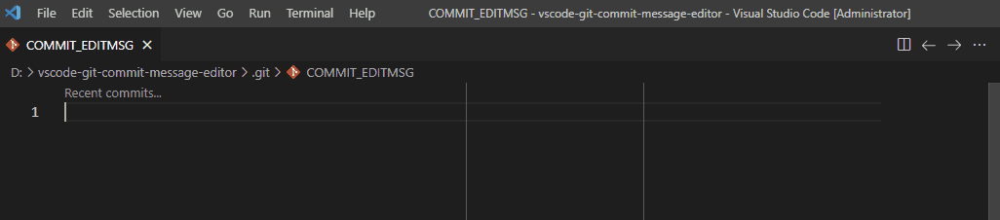

# Git Commit Message Editor

Edit commit messages via VS Code's editor, and Autocomplete for Conventional Commits.



## Features

- Supports to edit commit messages via VS Code's editor
    - See [details](#editor) below
- Supports IntelliSense feature to edit commit messages that conform to [Conventional Commits Specification](https://conventionalcommits.org/)
    - See [details](#intellisense) below
- Supports Workspace level scope management
    - See [details](#scope-completion) below
- Supports [Gitmoji](https://gitmoji.dev/)
    - See [details](#gitmoji-completion) below
- Selecting the previous commit message by `Recent commits...` CodeLens feature
    - See [details](#codelens) below

## Installation

To install this extension go to **View > Extensions** and search for `git-commit-message-editor`. Next click Install and then Reload.

## Usage

### Editor

You can open the commit message editor by click the **Edit icon** in the repository in the **Source Control** view.



Or select **Open Commit Message Editor** from the overflow menu in the repository in the **Source Control** view.
> Or launch **Git: Open Commit Message Editor** command on the **Command Palette**.



### IntelliSense

You can trigger **IntelliSense** in the commit message editor window by typing <kbd>Ctrl</kbd>+<kbd>Space</kbd> or by typing the letters.  
> Also supported in the [VS Code as Git editor](https://code.visualstudio.com/docs/editor/versioncontrol#_vs-code-as-git-editor) mode.



All completions conform to [**Conventional Commits Specification**](https://conventionalcommits.org/).

#### Commit Type completion

List of available conventional commit types:
> Commit types originally from [commitizen/cz-conventional-changelog](https://github.com/commitizen/cz-conventional-changelog)

| Type     | Title                    | Description                                                                                                 |
| -------- | ------------------------ | ----------------------------------------------------------------------------------------------------------- |
| feat     | Features                 | A new feature                                                                                               |
| fix      | Bug Fixes                | A bug fix                                                                                                   |
| docs     | Documentation            | Documentation only changes                                                                                  |
| style    | Styles                   | Changes that do not affect the meaning of the code (white-space, formatting, missing semi-colons, etc)      |
| refactor | Code Refactoring         | A code change that neither fixes a bug nor adds a feature                                                   |
| perf     | Performance Improvements | A code change that improves performance                                                                     |
| test     | Tests                    | Adding missing tests or correcting existing tests                                                           |
| build    | Builds                   | Changes that affect the build system or external dependencies (example scopes: gulp, broccoli, npm)         |
| ci       | Continuous Integrations  | Changes to our CI configuration files and scripts (example scopes: Travis, Circle, BrowserStack, SauceLabs) |
| chore    | Chores                   | Other changes that don't modify src or test files                                                           |
| revert   | Reverts                  | Reverts a previous commit                                                                                   |
| wip      | Work In Progress         | A commit that will be squashed later                                                                        |
| initial  | Initial                  | Initial commit                                                                                              |

#### Scope completion

You can type the scope as wish, select one that saved, or create new scope by selecting **Create New Scope** in the suggestion list.



The scopes user created will be saved into `workspace/.vscode/settings.json`.

#### Gitmoji completion

You can trigger the gitmoji suggestions by typing a trigger character `:` (colon).



The gitmoji completion only work in the subject secion of the summary and offers the gitmoji suggestions by `Commit Type` that you typed.

#### Footer Type completion

Also supports the footer type completion.



List of available conventional footer types:

| Type            | Title               | Description                                      |
| --------------- | ------------------- | ------------------------------------------------ |
| Closes          | Referencing issues  | A code change that related issues to close       |
| Refs            | Referencing commits | A code change that related other commits         |
| BREAKING CHANGE | Breaking changes    | A code change that causes other features to fail |

### CodeLens

To select the previous commit message, click the `Recent commits...` CodeLens link.
> Or use the keyboard shortcut <kbd>Ctrl</kbd>+<kbd>Shift</kbd>+<kbd>'</kbd>.



The CodeLens link will be appeared only when no commit message typed.

## Settings

Table of contributed settings (prefix "gitCommitMessageEditor."):

| Name                            | Default | Description                                                                            |
| ------------------------------- | ------- | -------------------------------------------------------------------------------------- |
| editor.keepAfterSave            | `false` | Controls whether the commit message editor tab keep or close, after saving             |
| codeLens.recentCommits.enabled  | `true`  | Controls whether the `Recent commits...` code lens feature is enabled or not           |
| codeLens.recentCommits.maxItems | `16`    | Specifies the maximum number of commits to show in the quick pick UI                   |
| intelliSense.completion.enabled | `true`  | Controls whether the \"Quick suggestions\" feature is enabled or not                   |
| intelliSense.completion.scopes  | `[]`    | Scopes that user created (Scopes will be saved into `workspace/.vscode/settings.json`) |

And recommends to add a setting below into your Global or Workspace `settings.json` to follow the **Git 50/72 rule**.

```json
"[git-commit]": {
    "editor.rulers": [
        50,
        72
    ]
}
```

## Issues

If you find any problems using this extension or you want to propose new features to it, feel free to open an issue on [Github](https://github.com/phoihos/vscode-git-commit-message-editor/issues).

## Release Notes

Detailed Release Notes are available [here](https://github.com/phoihos/vscode-git-commit-message-editor/blob/master/CHANGELOG.md) or above **Changelog** tab.

## Attributions

Icon made by [Freepik](https://www.flaticon.com/authors/freepik) from [www.flaticon.com](https://www.flaticon.com/)
